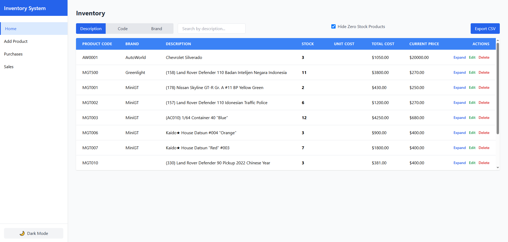

# 🧾 Inventory System

A full-stack inventory management system designed for efficient product and batch tracking, built with:

- ⚛️ **Frontend:** React.js + Tailwind CSS
- 🖥️ **Backend:** Express.js (Node.js)
- 🗃️ **Database:** PostgreSQL

---

## 🔗 Demo & Preview

- 🌐 **Live Demo:** [inventory-system.vercel.app](https://inventory-system-rust-three.vercel.app/)  
- 🖼️ **Preview Screenshot:**

  

---

## 📁 Project Structure

```text
  .
    ├── backend/ # Express.js server 
    ├── frontend/ # React frontend  
    ├── schema_backup.sql # Database schema only 
    └── README.md # Project Documentation
```

---

## 🚀 Getting Started

### 1. Clone the repository

```bash
git clone https://github.com/MarioAderman/inventory_system.git
cd inventory_system
```

### 2. Database Setup

> ***Make sure PostgreSQL is running, and update credentials as needed in the command below:***

```bash
psql -U inventory_admin -d inventory_db -f schema_backup.sql
```
> ***🔧 Replace inventory_admin and inventory_db with your actual PostgreSQL user and database names.***

### 3. Backend Setup

Create a `.env` file in the `backend/` directory and populate it with your database configuration:

 ```text
DB_USER=inventory_admin
DB_HOST=localhost # If run locally
DB_NAME=inventory
DB_PASSWORD='your_password'
DB_PORT=****
PORT=****
```

```bash
cd backend
npm install
npm start
```

### 4. Frontend Setup

```bash
cd frontend
npm install
npm run dev   # Or `npm start` depending on config
```

---

## 📦 Features

- 🔄 Product and batch tracking

- 📈 Purchase and sales management

- 📦 FIFO stock logic implementation

- 🗃️ PostgreSQL schema versioning

- 📤 CSV export support

- 🧼 Clean, responsive UI with Tailwind CSS

- 🌙 Built-in Dark Mode 

---

## 🛠 Tech Stack

|Layer	   | Tech             |
|----------|------------------|
|Frontend  |React.js, Tailwind|
|Backend   |Node.js, Express  |
|Database  |PostgreSQL        |

---

## 🤝 Contributing

Contributions are welcome! Feel free to fork this repo and open a pull request.
